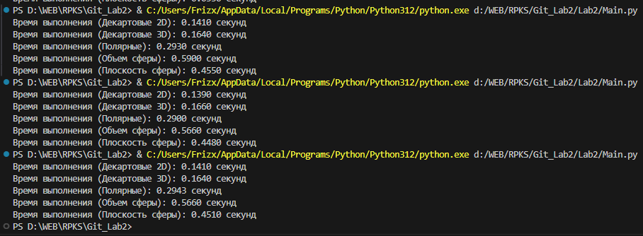
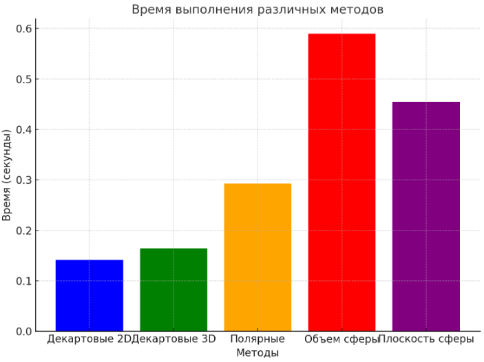

# Lab2
Завдання виконав Хорошев Михайло ІПЗ-4.03
Тема: реалізація перетворень між системами координат
При реалізаціі було виставлено 100000 точок для уникнення різниці при запуску:

Діаграма відображає порівняння перших значень:

Як показують дані, найбільш ефективним є мектод 2D декартові, і спадає з кожним наступним методом.
